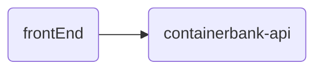

# Bienvenue sur l'application de l'equipe "TEAM PACIFICA"


## Livrables

- [ ] Le **code source** de l'application conteneurisée
- [ ] Le **readme.md**
- [ ] La liste des use case couverts

	- [ ] `ViewAdvisors` : voir une liste de conseillers et leurs spécialités (none, savings, credits ou insurance)<br/>
	- [ ] `ViewCustomer` : voir les informations relatives à un client<br/>
	- [ ] `EditCustomer` : mettre à jour les informations relatives à un client<br/>
	- [ ] `AddCustomer` : ajouter un nouveau client au système<br/>
	- [ ] `ViewCard` : voir les informations relatives à une carte bleue<br/>
	- [ ] `EditCard` : mettre à jour les informations relatives à une carte bleue<br/>
	- [ ] `AddCard` : ajouter une nouvelle carte bleue au système<br/>
	- [ ] `ViewPayment` : voir des informations relatives à l'historique de paiement d’une carte bleue<br/>
	- [ ] `AddPayment` : ajouter des informations relatives à un paiement (nature du paiement)<br/>
	- [ ] `Monitoring` : monitorer chaque appels et leur durée<br/>
	- [ ] `Logging` : centraliser les logs de l'application


## Accès

**Accèder au code source
```
https://github.com/pacificathon/hackathonpackapp/containerbank.git
```
**Accéder à l'application** 
`http://ec2-user@11.eu-west-1.compute.amazonaws.com:9966/containerbank/`

# L'application

## Architecture

L'application containerbank est séparée entre la une partie front (repertoire frontEnd) et une partie back (repertoire containerbank-api)


## Docker


# L'équipe 
- Jean-Patrick GUILLY 
- Patrick URBANSKI
- Thomas MARTZOLFF
- Nicolas LEMAIRE
