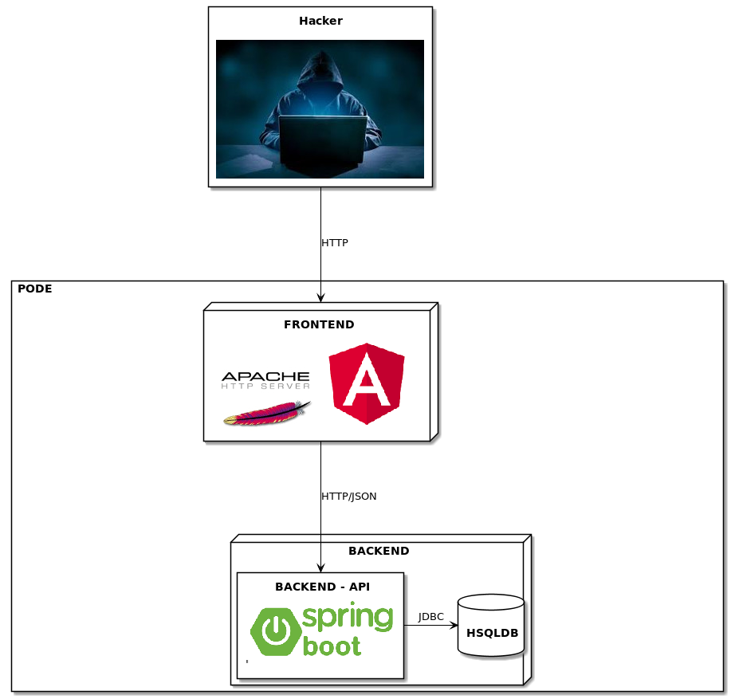

# Bienvenue sur l'application de l'equipe "TEAM PACIFICA"


https://packapp11.hackathon-container.com/

## Architecture

L'appli est architecturée de la manière suivante :



## Packaging

* Construction des images avec Maven et webpack
    * automatisation des constructions des images docker
    * versioning 
* api: backend spring boot 
    * gestion simplifiée des paramètres de déploiement (clé/valeur)
    * démarrage rapide de l'application
* fontend: 
    * Angular développement et déploiement rapide
    * Boostrap pour le look and feel


## Livrables

- [x] Le **code source** de l'application conteneurisée
- [x] Le **readme.md**
- [x] La liste des use case couverts

	- [x] `ViewAdvisors` : voir une liste de conseillers et leurs spécialités (none, savings, credits ou insurance)<br/>
	- [x] `ViewCustomer` : voir les informations relatives à un client<br/>
	- [x] `EditCustomer` : mettre à jour les informations relatives à un client<br/>
	- [x] `AddCustomer` : ajouter un nouveau client au système<br/>
	- [ ] `ViewCard` : voir les informations relatives à une carte bleue<br/>
	- [ ] `EditCard` : mettre à jour les informations relatives à une carte bleue<br/>
	- [ ] `AddCard` : ajouter une nouvelle carte bleue au système<br/>
	- [ ] `ViewPayment` : voir des informations relatives à l'historique de paiement d’une carte bleue<br/>
	- [ ] `AddPayment` : ajouter des informations relatives à un paiement (nature du paiement)<br/>
	- [ ] `Monitoring` : monitorer chaque appels et leur durée<br/>
	- [x] `Logging` : centraliser les logs de l'application

Les descripteurs de déploiement Kubernetes sont dans le dossier tools.

## Accès

**Accéder au code source**
```
https://github.com/teampacifica2/pacificathon
```
**Accéder à l'application** 
`https://packapp11.hackathon-container.com`

## L'équipe 
- Jean-Patrick GUILLY 
- Patrick URBANSKI
- Thomas MARTZOLFF
- Nicolas LEMAIRE
